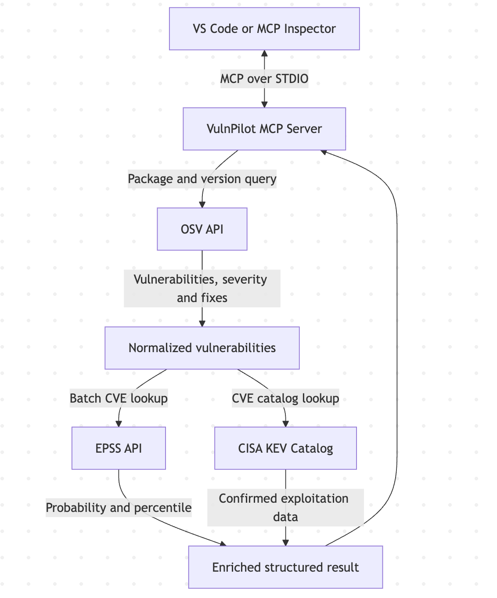
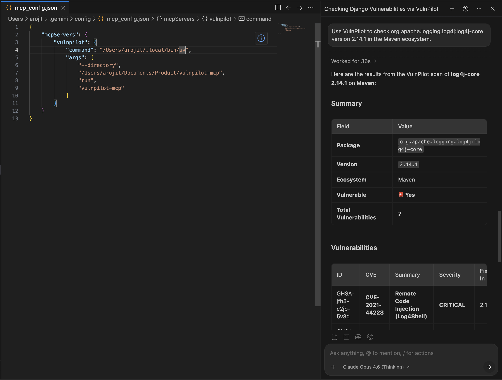
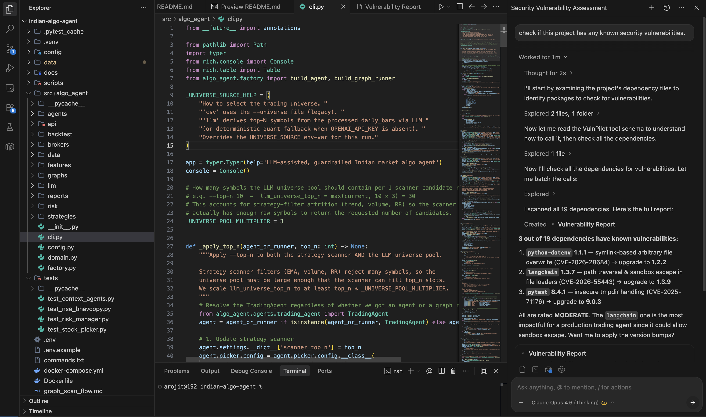

<p align="center">
  <h1 align="center">🛡️ VulnPilot</h1>
  <p align="center">
    <strong>An MCP server that gives AI assistants the ability to check open-source packages for vulnerabilities and real-world exploit intelligence — powered by <a href="https://osv.dev">OSV.dev</a>, <a href="https://www.first.org/epss/">EPSS</a>, and <a href="https://www.cisa.gov/known-exploited-vulnerabilities-catalog">CISA KEV</a>.</strong>
  </p>
  <p align="center">
    <a href="#quickstart">Quickstart</a> · <a href="#how-it-works">How It Works</a> · <a href="#tool-reference">Tool Reference</a> · <a href="#development">Development</a>
  </p>
</p>

---

## Why VulnPilot?

Modern AI coding assistants can write, refactor, and review code - but they're blind to the security posture and real-world exploitability of the dependencies they recommend. VulnPilot bridges that gap.

By exposing a single, focused [Model Context Protocol (MCP)](https://modelcontextprotocol.io) tool, VulnPilot lets any MCP-compatible client - Claude Desktop, Cursor, VS Code Copilot, and others - query the [OSV.dev](https://osv.dev) database in real time. 

Beyond standard vulnerability scanning, VulnPilot enriches findings with actionable threat intelligence:
- **FIRST EPSS Scores:** Real-time probability metrics detailing the likelihood of a vulnerability being exploited in the next 30 days.
- **CISA KEV Catalog:** Direct indicators flagging if a vulnerability is actively exploited in active cyberattacks or ransomware campaigns.

**No API keys. No complex configuration. Just install, connect, and let your AI agent code securely.**

---

## Quickstart

### Prerequisites

| Requirement | Version |
|---|---|
| Python | ≥ 3.10 |
| [uv](https://docs.astral.sh/uv/) | latest (recommended) |

### Install

```bash
# Clone the repository
git clone https://github.com/arojit/vulnpilot-mcp.git
cd vulnpilot-mcp

# Create the virtual environment and install dependencies
uv sync
```

### Run

```bash
# Start the server (STDIO transport)
uv run vulnpilot-mcp
```

The server launches on **STDIO**, ready to be connected to any MCP client.

---

## Connecting to MCP Clients

Add VulnPilot to your client's MCP configuration:

<details>
<summary><strong>Claude Desktop</strong></summary>

Add the following to your `claude_desktop_config.json`:

```json
{
  "mcpServers": {
    "vulnpilot": {
      "command": "/absolute/path/to/uv",
      "args": [
        "--directory", "/absolute/path/to/vulnpilot-mcp",
        "run", "vulnpilot-mcp"
      ]
    }
  }
}
```

</details>

<details>
<summary><strong>Cursor</strong></summary>

Add to your `.cursor/mcp.json`:

```json
{
  "mcpServers": {
    "vulnpilot": {
      "command": "/absolute/path/to/uv",
      "args": [
        "--directory", "/absolute/path/to/vulnpilot-mcp",
        "run", "vulnpilot-mcp"
      ]
    }
  }
}
```

</details>

<details>
<summary><strong>VS Code / Copilot</strong></summary>

Add to your `.vscode/mcp.json`:

```json
{
  "servers": {
    "vulnpilot": {
      "command": "/absolute/path/to/uv",
      "args": [
        "--directory", "/absolute/path/to/vulnpilot-mcp",
        "run", "vulnpilot-mcp"
      ]
    }
  }
}
```

</details>

> **Note:** Replace `/absolute/path/to/uv` with the absolute path to your `uv` binary (find it with `which uv`) and `/absolute/path/to/vulnpilot-mcp` with the actual path where you cloned the repository.

---

## How It Works

<p align="center">
  
</p>

1. Your AI assistant decides it needs to verify a dependency.
2. It calls the `check_package` tool via the MCP protocol.
3. VulnPilot queries the [OSV API](https://osv.dev/docs/) and returns a structured result.
4. The assistant uses the response to inform its recommendation.

---

## Tool Reference

### `check_package`

Check a specific package version for known vulnerabilities.

| Parameter | Type | Default | Description |
|---|---|---|---|
| `package_name` | `string` | *required* | Package name (e.g. `django`, `lodash`, `org.apache.logging.log4j:log4j-core`) |
| `version` | `string` | *required* | Exact version to check (e.g. `2.2.0`) |
| `ecosystem` | `string` | `"PyPI"` | One of `PyPI`, `npm`, `Maven`, or `Gradle` |

> **Maven & Gradle:** Use the `groupId:artifactId` format for package names (e.g. `org.apache.logging.log4j:log4j-core`). Gradle packages are queried against the Maven ecosystem in OSV.

#### Example Request

```
Check django version 2.2.0 for vulnerabilities
```

#### Example Response

```json
{
  "package_name": "django",
  "version": "2.2.0",
  "ecosystem": "PyPI",
  "vulnerable": true,
  "vulnerability_count": 1,
  "vulnerabilities": [
    {
      "id": "GHSA-xxxx-yyyy-zzzz",
      "summary": "Django SQL injection vulnerability",
      "aliases": ["CVE-2024-XXXXX"],
      "severity": "HIGH",
      "fixed_versions": ["2.2.10"],
      "references": ["https://github.com/advisories/..."],
      "exploit_intelligence": {
        "epss_cve": "CVE-2024-XXXXX",
        "epss_probability": 0.0892,
        "epss_percentile": 0.4215,
        "known_exploited": true,
        "cisa_kev_cve": "CVE-2024-XXXXX",
        "cisa_date_added": "2024-02-15",
        "cisa_due_date": "2024-03-07",
        "cisa_required_action": "Apply updates per vendor instructions.",
        "known_ransomware_campaign_use": "Known"
      }
    }
  ],
  "enrichment_warnings": []
}
```

#### Example in Action

- **Example 1**
  <p align="center">
    
  </p>
- **Example 2**
  <p align="center">
    
  </p>

### Response Schema

| Field | Type | Description |
|---|---|---|
| `package_name` | `string` | The queried package name |
| `version` | `string` | The queried version |
| `ecosystem` | `string` | The ecosystem used for the query |
| `vulnerable` | `boolean` | `true` if any vulnerabilities were found |
| `vulnerability_count` | `integer` | Number of known vulnerabilities |
| `vulnerabilities` | `array` | List of vulnerability objects |
| `enrichment_warnings` | `string[]` | Warnings/errors encountered during EPSS or CISA KEV enrichment |

Each **vulnerability** contains:

| Field | Type | Description |
|---|---|---|
| `id` | `string` | Vulnerability identifier (e.g. `GHSA-…`, `PYSEC-…`) |
| `summary` | `string` | Human-readable description |
| `aliases` | `string[]` | Cross-references (e.g. CVE IDs) |
| `severity` | `string \| null` | Severity level when available |
| `fixed_versions` | `string[]` | Versions that resolve the issue |
| `references` | `string[]` | Links to advisories and patches |
| `exploit_intelligence` | `object` | Real-world exploitation intelligence (EPSS & CISA KEV data) |

The **exploit_intelligence** object contains:

| Field | Type | Description |
|---|---|---|
| `epss_cve` | `string \| null` | The CVE identifier matched for EPSS scoring |
| `epss_probability` | `float \| null` | Probability of exploitation in the next 30 days (0.0 to 1.0) |
| `epss_percentile` | `float \| null` | Percentile of the score relative to all other CVEs (0.0 to 1.0) |
| `known_exploited` | `boolean` | `true` if the vulnerability is listed in the CISA KEV catalog |
| `cisa_kev_cve` | `string \| null` | The CVE identifier matched in the CISA KEV catalog |
| `cisa_date_added` | `string \| null` | Date (YYYY-MM-DD) when it was added to the CISA KEV catalog |
| `cisa_due_date` | `string \| null` | Date (YYYY-MM-DD) by which federal agencies must remediate it |
| `cisa_required_action` | `string \| null` | The action required to address the vulnerability per CISA KEV |
| `known_ransomware_campaign_use` | `string \| null` | Indicates whether it is known to be used in ransomware campaigns |

---

## Supported Ecosystems

| Ecosystem | Package Name Format | Example |
|---|---|---|
| **PyPI** | `package-name` | `django` |
| **npm** | `package-name` | `lodash` |
| **Maven** | `groupId:artifactId` | `org.apache.logging.log4j:log4j-core` |
| **Gradle** | `groupId:artifactId` | `com.google.guava:guava` |

---

## Development

### Setup

```bash
# Install all dependencies including dev tools
uv sync --all-groups
```

### Running Tests

```bash
uv run pytest
```

### MCP Inspector

Launch the interactive [MCP Inspector](https://modelcontextprotocol.io/docs/tools/inspector) to test and debug the server in your browser:

```bash
uv run mcp dev src/vulnpilot/server.py
```

### Project Structure

```
vulnpilot-mcp/
├── src/vulnpilot/
│   ├── __init__.py        # Package marker
│   ├── server.py          # MCP server & tool definitions
│   ├── models.py          # Pydantic response models
│   ├── osv_client.py      # OSV API client & response normalizer
│   ├── epss_client.py     # EPSS Score API client
│   ├── cisa_kev_client.py # CISA Known Exploited Vulnerabilities client
│   └── cve_utils.py       # CVE extraction utilities
├── tests/
│   ├── test_server.py          # Server test suite
│   ├── test_epss_client.py     # EPSS client test suite
│   └── test_cisa_kev_client.py # CISA KEV client test suite
├── pyproject.toml         # Project metadata & dependencies
└── README.md
```

---

## Tech Stack

| Layer | Technology |
|---|---|
| MCP Framework | [FastMCP](https://github.com/modelcontextprotocol/python-sdk) (`mcp[cli]`) |
| Data Validation | [Pydantic v2](https://docs.pydantic.dev) |
| HTTP Client | [httpx](https://www.python-httpx.org) |
| Vulnerability Data | [OSV.dev API](https://osv.dev) |
| Exploit Intel | [FIRST EPSS](https://www.first.org/epss/) & [CISA KEV Catalog](https://www.cisa.gov/known-exploited-vulnerabilities-catalog) |
| Build System | [Hatchling](https://hatch.pypa.io) |
| Package Manager | [uv](https://docs.astral.sh/uv/) |
| Testing | [pytest](https://docs.pytest.org) + [pytest-asyncio](https://pytest-asyncio.readthedocs.io) |

---

## License

This project is currently unlicensed. See the repository for updates.
