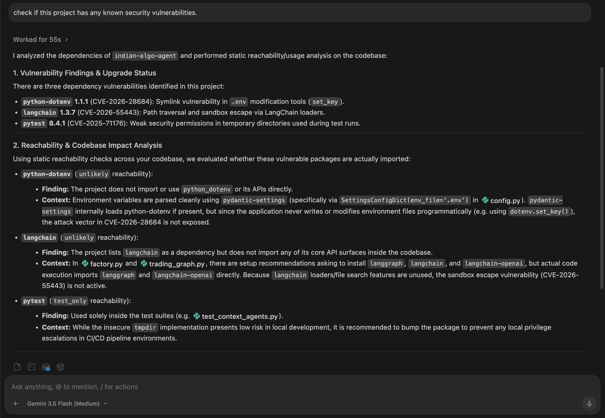

<p align="center">
  <h1 align="center">🛡️ VulnPilot</h1>
  <p align="center">
    <strong>An MCP server that gives AI assistants the ability to check open-source packages for vulnerabilities, enrich findings with real-world exploit intelligence, and statically analyse whether vulnerable code is actually reachable in your project — powered by <a href="https://osv.dev">OSV.dev</a>, <a href="https://www.first.org/epss/">EPSS</a>, and <a href="https://www.cisa.gov/known-exploited-vulnerabilities-catalog">CISA KEV</a>.</strong>
  </p>
  <p align="center">
    <a href="#quickstart">Quickstart</a> · <a href="#how-it-works">How It Works</a> · <a href="#tool-reference">Tool Reference</a> · <a href="#reachability-analysis">Reachability Analysis</a> · <a href="#development">Development</a>
  </p>
</p>

---

## Why VulnPilot?

Modern AI coding assistants can write, refactor, and review code — but they're blind to the security posture and real-world exploitability of the dependencies they recommend. VulnPilot bridges that gap.

By exposing focused [Model Context Protocol (MCP)](https://modelcontextprotocol.io) tools, VulnPilot lets any MCP-compatible client — Claude Desktop, Cursor, VS Code Copilot, and others — query the [OSV.dev](https://osv.dev) database in real time and reason about your actual source code.

Knowing a package is vulnerable is only half the story. The questions that actually determine your risk are: **does your project even call into that vulnerable code?** and **is it a direct dependency or just pulled in transitively?** VulnPilot answers both — by statically scanning your project's imports across Python, JavaScript/TypeScript, and Java, classifying each dependency as direct or transitive by inspecting manifest and lock files, and telling your AI assistant whether a vulnerability is reachable in production code, test-only, or not used at all.

Beyond vulnerability detection, VulnPilot enriches findings with actionable threat intelligence:
- **Reachability Analysis:** Statically scans your source code to determine whether a vulnerable package is actually imported — and whether that import is in production code or only in tests. Supports Python, JavaScript/TypeScript, and Java (Maven & Gradle).
- **Direct vs Transitive Detection:** Inspects project manifests (`pyproject.toml`, `requirements.txt`, `package.json`, `pom.xml`, `build.gradle`) and lock files (`uv.lock`, `poetry.lock`, `package-lock.json`, `yarn.lock`, and more) to classify each dependency as `direct` or `transitive`, with evidence of where it was found.
- **Triage Priority Engine:** Automatically classifies findings as `IMMEDIATE`, `URGENT`, `HIGH`, or `NORMAL` based on code reachability, dependency scope, and exploit telemetry.
- **FIRST EPSS Scores:** Real-time probability metrics detailing the likelihood of a vulnerability being exploited in the next 30 days.
- **CISA KEV Catalog:** Direct indicators flagging if a vulnerability is actively exploited in cyberattacks or ransomware campaigns.

**No API keys. No complex configuration. Just install, connect, and let your AI agent code securely.**

---

## Quickstart

### Prerequisites

| Requirement | Version |
|---|---|
| Python | ≥ 3.10 |
| [uv](https://docs.astral.sh/uv/) | latest (recommended) |

### Install

```bash
# Clone the repository
git clone https://github.com/arojit/vulnpilot-mcp.git
cd vulnpilot-mcp

# Create the virtual environment and install dependencies
uv sync
```

### Run

```bash
# Start the server (STDIO transport)
uv run vulnpilot-mcp
```

The server launches on **STDIO**, ready to be connected to any MCP client.

---

## Connecting to MCP Clients

Add VulnPilot to your client's MCP configuration:

<details>
<summary><strong>Claude Desktop</strong></summary>

Add the following to your `claude_desktop_config.json`:

```json
{
  "mcpServers": {
    "vulnpilot": {
      "command": "/absolute/path/to/uv",
      "args": [
        "--directory", "/absolute/path/to/vulnpilot-mcp",
        "run", "vulnpilot-mcp"
      ]
    }
  }
}
```

</details>

<details>
<summary><strong>Cursor</strong></summary>

Add to your `.cursor/mcp.json`:

```json
{
  "mcpServers": {
    "vulnpilot": {
      "command": "/absolute/path/to/uv",
      "args": [
        "--directory", "/absolute/path/to/vulnpilot-mcp",
        "run", "vulnpilot-mcp"
      ]
    }
  }
}
```

</details>

<details>
<summary><strong>VS Code / Copilot</strong></summary>

Add to your `.vscode/mcp.json`:

```json
{
  "servers": {
    "vulnpilot": {
      "command": "/absolute/path/to/uv",
      "args": [
        "--directory", "/absolute/path/to/vulnpilot-mcp",
        "run", "vulnpilot-mcp"
      ]
    }
  }
}
```

</details>

> **Note:** Replace `/absolute/path/to/uv` with the absolute path to your `uv` binary (find it with `which uv`) and `/absolute/path/to/vulnpilot-mcp` with the actual path where you cloned the repository.

> **Troubleshooting – SSL certificate errors:** If you see SSL/TLS errors (common on corporate networks or machines with custom root CAs), add `--system-certs` to the `run` command so that `uv` uses your operating system's certificate store:
> ```json
> "args": [
>   "--directory", "/absolute/path/to/vulnpilot-mcp",
>   "run", "--system-certs", "vulnpilot-mcp"
> ]
> ```

---

## How It Works

<p align="center">
  
</p>

**Checking for vulnerabilities (`check_package`):**
1. Your AI assistant calls `check_package` with a package name and version.
2. VulnPilot queries the [OSV API](https://osv.dev/docs/) and normalizes the raw advisories.
3. CVE identifiers are batch-queried against [FIRST EPSS](https://www.first.org/epss/) and the [CISA KEV Catalog](https://www.cisa.gov/known-exploited-vulnerabilities-catalog).
4. The priority engine combines exploit telemetry, reachability, and dependency scope into a single triage signal (`IMMEDIATE` → `NORMAL`).
5. The enriched `PackageCheckResult` is returned to the assistant.

**Checking reachability (`analyze_*_reachability`):**
1. Your AI assistant calls the appropriate reachability tool with a project path and package name.
2. VulnPilot scans the source files, finds every import of that package, and classifies each usage as production or test-only.
3. The assistant can then tell you: "This vulnerability is reachable in production code" or "It's only used in tests — lower priority."

---

## Tool Reference

VulnPilot exposes MCP **tools**, **prompts**, and **resources**.

- **Tools** — callable functions for vulnerability lookup and reachability analysis.
- **Prompts** — parameterized instruction templates that guide the AI through multi-step workflows.
- **Resources** — read-only reference data the AI can pull for context (e.g. triage rules, supported ecosystems).

---

### `check_package`

Check a specific package version for known vulnerabilities, enriched with EPSS scores, CISA KEV status, and a triage priority.

| Parameter | Type | Default | Description |
|---|---|---|---|
| `package_name` | `string` | *required* | Package name (e.g. `django`, `lodash`, `org.apache.logging.log4j:log4j-core`) |
| `version` | `string` | *required* | Exact version to check (e.g. `2.2.0`) |
| `ecosystem` | `string` | `"PyPI"` | One of `PyPI`, `npm`, `Maven`, or `Gradle` |
| `is_reachable` | `boolean` | `null` | Optional. Indicates if the vulnerability is reachable in your codebase |
| `dependency_scope` | `string` | `"unknown"` | Optional. The usage scope of the dependency (`production`, `development`, `unknown`) |

> **Maven & Gradle:** Use the `groupId:artifactId` format for package names (e.g. `org.apache.logging.log4j:log4j-core`). Gradle packages are queried against the Maven ecosystem in OSV.

#### Example Request

```
Check django version 2.2.0 for vulnerabilities
```

#### Example Response

```json
{
  "package_name": "django",
  "version": "2.2.0",
  "ecosystem": "PyPI",
  "vulnerable": true,
  "vulnerability_count": 1,
  "vulnerabilities": [
    {
      "id": "GHSA-xxxx-yyyy-zzzz",
      "summary": "Django SQL injection vulnerability",
      "aliases": ["CVE-2024-XXXXX"],
      "severity": "HIGH",
      "fixed_versions": ["2.2.10"],
      "references": ["https://github.com/advisories/..."],
      "exploit_intelligence": {
        "epss_cve": "CVE-2024-XXXXX",
        "epss_probability": 0.0892,
        "epss_percentile": 0.4215,
        "known_exploited": true,
        "cisa_kev_cve": "CVE-2024-XXXXX",
        "cisa_date_added": "2024-02-15",
        "cisa_due_date": "2024-03-07",
        "cisa_required_action": "Apply updates per vendor instructions.",
        "known_ransomware_campaign_use": "Known"
      },
      "priority": "IMMEDIATE"
    }
  ],
  "enrichment_warnings": []
}
```

#### Example in Action

- **Example 1**
  <p align="center">
    
  </p>
- **Example 2**
  <p align="center">
    
  </p>
- **Example 3**
  <p align="center">
    
  </p>

### Response Schema

| Field | Type | Description |
|---|---|---|
| `package_name` | `string` | The queried package name |
| `version` | `string` | The queried version |
| `ecosystem` | `string` | The ecosystem used for the query |
| `vulnerable` | `boolean` | `true` if any vulnerabilities were found |
| `vulnerability_count` | `integer` | Number of known vulnerabilities |
| `vulnerabilities` | `array` | List of vulnerability objects |
| `enrichment_warnings` | `string[]` | Warnings/errors encountered during EPSS or CISA KEV enrichment |

Each **vulnerability** contains:

| Field | Type | Description |
|---|---|---|
| `id` | `string` | Vulnerability identifier (e.g. `GHSA-…`, `PYSEC-…`) |
| `summary` | `string` | Human-readable description |
| `aliases` | `string[]` | Cross-references (e.g. CVE IDs) |
| `severity` | `string \| null` | Severity level when available |
| `fixed_versions` | `string[]` | Versions that resolve the issue |
| `references` | `string[]` | Links to advisories and patches |
| `exploit_intelligence` | `object` | Real-world exploitation intelligence (EPSS & CISA KEV data) |
| `priority` | `string` | Calculated triage priority (`IMMEDIATE`, `URGENT`, `HIGH`, `NORMAL`) |

The **exploit_intelligence** object contains:

| Field | Type | Description |
|---|---|---|
| `epss_cve` | `string \| null` | The CVE identifier matched for EPSS scoring |
| `epss_probability` | `float \| null` | Probability of exploitation in the next 30 days (0.0 to 1.0) |
| `epss_percentile` | `float \| null` | Percentile of the score relative to all other CVEs (0.0 to 1.0) |
| `known_exploited` | `boolean` | `true` if the vulnerability is listed in the CISA KEV catalog |
| `cisa_kev_cve` | `string \| null` | The CVE identifier matched in the CISA KEV catalog |
| `cisa_date_added` | `string \| null` | Date (YYYY-MM-DD) when it was added to the CISA KEV catalog |
| `cisa_due_date` | `string \| null` | Date (YYYY-MM-DD) by which federal agencies must remediate it |
| `cisa_required_action` | `string \| null` | The action required to address the vulnerability per CISA KEV |
| `known_ransomware_campaign_use` | `string \| null` | Indicates whether it is known to be used in ransomware campaigns |

### Triage Priority Rules

VulnPilot automatically assigns a remediation priority (`IMMEDIATE`, `URGENT`, `HIGH`, or `NORMAL`) using deterministic rules based on code reachability, dependency scope, and exploit telemetry:

| Priority | Condition | Reasoning |
|---|---|---|
| **IMMEDIATE** | Listed in the CISA KEV catalog (`known_exploited = true`) | Actively exploited in cyberattacks or ransomware campaigns in the wild. |
| **URGENT** | Reachable code (`is_reachable = true`) AND high EPSS probability (`>= 0.5`) | High probability of imminent exploit, and the code path is active. |
| **HIGH** | Production dependency (`dependency_scope = "production"`) AND severity is `CRITICAL` | Severe vulnerability exposed in the production environment. |
| **NORMAL** | Default fallback for all other vulnerabilities | Lower risk/exploit probability, or restricted to development/unreachable code. |

---

## Reachability Analysis

Knowing a package has a CVE doesn't tell you whether *your* code is actually at risk. VulnPilot's reachability tools scan your project's source files to find every place a package is imported, distinguish production imports from test-only ones, and surface that context to your AI assistant — so it can give you a genuinely accurate risk assessment instead of a blanket "upgrade everything".

All reachability tools perform **static import detection**. They do not execute code and cannot trace dynamic call paths or runtime plugin loading — see the `limitations` field in each response for details.

### `analyze_python_reachability`

Scans a Python project for imports of a given PyPI package. Uses Python's `ast` module for accurate parse-tree analysis rather than simple text search.

| Parameter | Type | Default | Description |
|---|---|---|---|
| `project_path` | `string` | *required* | Absolute path to the project root directory |
| `package_name` | `string` | *required* | PyPI package name (e.g. `requests`) |
| `import_names` | `string[]` | *auto-derived* | Override the Python import name when it differs from the package name (e.g. `["bs4"]` for `beautifulsoup4`) |

Detects both `import requests` and `from requests.sessions import Session` style imports.

**Dependency classification:** Inspects `pyproject.toml` (PEP 621 & Poetry), `setup.cfg`, `requirements.txt`, `requirements.in`, and lock files (`uv.lock`, `poetry.lock`, `pdm.lock`, `pylock.toml`) to determine whether the package is a direct or transitive dependency.

### `analyze_javascript_reachability`

Scans a JavaScript or TypeScript project for imports of a given npm package. Covers ES module `import`, CommonJS `require()`, and dynamic `import()` calls.

| Parameter | Type | Default | Description |
|---|---|---|---|
| `project_path` | `string` | *required* | Absolute path to the project root directory |
| `package_name` | `string` | *required* | npm package name, including scoped packages (e.g. `lodash`, `@example/api-client`) |
| `import_names` | `string[]` | *auto-derived* | Override the import name if needed |

Supports `.js`, `.jsx`, `.ts`, `.tsx`, `.mjs`, and `.cjs` files. Correctly handles subpath imports (`lodash/get`) and ignores commented-out imports.

**Dependency classification:** Inspects `package.json` (all dependency fields including `devDependencies`, `peerDependencies`, `optionalDependencies`) and lock files (`package-lock.json`, `npm-shrinkwrap.json`, `yarn.lock`, `pnpm-lock.yaml`) to determine whether the package is a direct or transitive dependency.

### `analyze_java_reachability`

Scans a Java project for imports of a given Maven package and classifies it as a **direct** or **transitive** dependency.

| Parameter | Type | Default | Description |
|---|---|---|---|
| `project_path` | `string` | *required* | Absolute path to the project root directory |
| `package_name` | `string` | *required* | Maven coordinate in `groupId:artifactId` format (e.g. `org.apache.logging.log4j:log4j-core`) |
| `import_names` | `string[]` | *auto-derived* | Override the Java package prefix when it differs from the group ID |

Auto-detects the build system (Maven `pom.xml` or Gradle `build.gradle` / `build.gradle.kts`). Inspects build files for direct declarations and dependency tree reports (`maven-dependency-tree.txt`, `gradle-dependencies.txt`) to classify the dependency as direct or transitive.

### Reachability Response Schema

All three tools return the same `ReachabilityResult` shape:

| Field | Type | Description |
|---|---|---|
| `package_name` | `string` | The queried package |
| `ecosystem` | `string` | `PyPI`, `npm`, or `Maven` |
| `import_names` | `string[]` | The import name(s) scanned for |
| `build_system` | `string \| null` | Detected build system (`maven`, `gradle`, `unknown`) — Java only |
| `dependency_type` | `string` | `direct` if declared in a manifest/build file, `transitive` if only found in a lock file or dependency tree, otherwise `unknown` |
| `dependency_evidence` | `string[]` | Human-readable evidence explaining how the dependency type was determined (e.g. `"Found in pyproject.toml [project.dependencies]"`) |
| `usage_found` | `boolean` | `true` if any import was found anywhere in the project |
| `production_usage_found` | `boolean` | `true` if at least one non-test file imports the package |
| `test_only` | `boolean` | `true` if the package is imported only in test files |
| `used_in` | `UsageLocation[]` | List of every file and line where an import was found |
| `reachability` | `string` | `"likely"` (production usage found) or `"unlikely"` |
| `limitations` | `string[]` | Caveats about the static analysis approach |

Each **UsageLocation** contains:

| Field | Type | Description |
|---|---|---|
| `file` | `string` | Relative path to the file |
| `line` | `integer` | Line number of the import |
| `imported_name` | `string` | The exact module/package name as written in the source |
| `kind` | `string` | Import style: `import`, `from_import`, `require`, or `dynamic_import` |
| `is_test_file` | `boolean` | `true` if the file was identified as a test file |

---

### Prompts

Prompts are reusable, parameterized templates that guide the AI assistant through multi-step security workflows. MCP clients that support prompts can present them as selectable actions.

#### `security_audit`

Run a full security audit across a list of project dependencies. The prompt instructs the AI to check each dependency for vulnerabilities, run reachability analysis on any that are vulnerable, and produce a prioritized summary report.

| Parameter | Type | Description |
|---|---|---|
| `project_path` | `string` | Absolute path to the project root directory |
| `ecosystem` | `string` | One of `PyPI`, `npm`, `Maven`, or `Gradle` |
| `dependencies` | `string` | Comma-separated `name:version` pairs (e.g. `"django:4.2.0, requests:2.31.0"`) |

#### `triage_vulnerability`

Deep-dive triage of a single dependency. Walks the AI through vulnerability lookup, reachability analysis, and a prioritized remediation recommendation — including CISA KEV urgency and direct vs transitive classification.

| Parameter | Type | Description |
|---|---|---|
| `package_name` | `string` | Package name (e.g. `django`, `lodash`, `org.apache.logging.log4j:log4j-core`) |
| `version` | `string` | Exact version to check |
| `ecosystem` | `string` | One of `PyPI`, `npm`, `Maven`, or `Gradle` |
| `project_path` | `string` | Absolute path to the project root directory |

#### `generate_dependency_evidence`

Returns the shell commands the user needs to run so that VulnPilot can classify dependencies as direct or transitive for a given ecosystem.

| Parameter | Type | Description |
|---|---|---|
| `ecosystem` | `string` | One of `PyPI`, `npm`, `Maven`, or `Gradle` |

---

### Resources

Resources expose read-only reference data that the AI assistant can request for additional context.

| URI | Name | MIME Type | Description |
|---|---|---|---|
| `vulnpilot://supported-ecosystems` | Supported Ecosystems | `application/json` | JSON listing of every ecosystem VulnPilot supports, including package name format, available tools, and example coordinates. |
| `vulnpilot://triage-rules` | Triage Priority Rules | `text/markdown` | Explains the deterministic rules VulnPilot uses to assign `IMMEDIATE`, `URGENT`, `HIGH`, or `NORMAL` priority. |
| `vulnpilot://dependency-evidence-guide` | Dependency Evidence Guide | `text/markdown` | Step-by-step commands to generate lock files and dependency tree reports for each ecosystem. |

---

## Generating Dependency Evidence

VulnPilot automatically reads **lock files** and **manifest files** that already exist in your project. For ecosystems that don't produce a lock file by default, you can generate a dependency report so VulnPilot can classify dependencies as direct or transitive.

> **Run these commands from the root of the project being analyzed — not from the VulnPilot directory.**

<details>
<summary><strong>Python — pip</strong></summary>

If you use pip without a modern lock file, export the installed-package metadata:

```bash
mkdir -p .vulnpilot
python -m pip inspect --local > .vulnpilot/pip-inspect.json
```

If the virtual environment is **not** activated:

```bash
mkdir -p .vulnpilot
.venv/bin/python -m pip inspect --local > .vulnpilot/pip-inspect.json
```

</details>

<details>
<summary><strong>Python — uv, Poetry, or PDM</strong></summary>

**No command is required** when the corresponding lock file exists:

| Tool | Lock file |
|---|---|
| uv | `uv.lock` |
| Poetry | `poetry.lock` |
| PDM | `pdm.lock` |
| PEP 751 | `pylock.toml` |

</details>

<details>
<summary><strong>JavaScript / TypeScript — npm, Yarn, or pnpm</strong></summary>

**No command is required** when the corresponding lock file exists:

| Tool | Lock file |
|---|---|
| npm | `package-lock.json` |
| Yarn | `yarn.lock` |
| pnpm | `pnpm-lock.yaml` |

</details>

<details>
<summary><strong>Java — Maven</strong></summary>

Generate the dependency tree report:

```bash
mkdir -p .vulnpilot
mvn dependency:tree \
  -DoutputFile=.vulnpilot/maven-dependency-tree.txt
```

</details>

<details>
<summary><strong>Java — Gradle</strong></summary>

Generate the runtime dependency tree:

```bash
mkdir -p .vulnpilot
./gradlew dependencies \
  --configuration runtimeClasspath \
  > .vulnpilot/gradle-dependencies.txt
```

For test dependencies:

```bash
mkdir -p .vulnpilot
./gradlew dependencies \
  --configuration testRuntimeClasspath \
  > .vulnpilot/gradle-test-dependencies.txt
```

</details>

> **Tip:** The `.vulnpilot/` directory is a good candidate for `.gitignore` — the reports are generated per-environment and should not be committed.

---

## Supported Ecosystems

| Ecosystem | `check_package` | Reachability Analysis | Package Name Format | Example |
|---|---|---|---|---|
| **PyPI** | ✅ | ✅ `analyze_python_reachability` | `package-name` | `django` |
| **npm** | ✅ | ✅ `analyze_javascript_reachability` | `package-name` | `lodash` |
| **Maven** | ✅ | ✅ `analyze_java_reachability` | `groupId:artifactId` | `org.apache.logging.log4j:log4j-core` |
| **Gradle** | ✅ | ✅ `analyze_java_reachability` | `groupId:artifactId` | `com.google.guava:guava` |

---

## Development

### Setup

```bash
# Install all dependencies including dev tools
uv sync --all-groups
```

### Running Tests

```bash
uv run pytest
```

### MCP Inspector

Launch the interactive [MCP Inspector](https://modelcontextprotocol.io/docs/tools/inspector) to test and debug the server in your browser:

```bash
uv run mcp dev src/vulnpilot/server.py
```

### Project Structure

```
vulnpilot-mcp/
├── src/vulnpilot/
│   ├── __init__.py        # Package marker
│   ├── server.py          # MCP server: tools, prompts & resources
│   ├── models.py          # Pydantic response models
│   ├── osv_client.py      # OSV API client & response normalizer
│   ├── epss_client.py     # EPSS Score API client
│   ├── cisa_kev_client.py # CISA Known Exploited Vulnerabilities client
│   ├── triage.py          # Remediation priority engine
│   ├── cve_utils.py       # CVE extraction utilities
│   └── reachability/      # Reachability analysis (language-specific modules)
│       ├── __init__.py               # Re-exports all public symbols
│       ├── _common.py                # Shared helpers (path filtering, test detection, DependencyClassification)
│       ├── python_reachability.py    # Python / PyPI import scanner
│       ├── python_dependencies.py    # Python direct vs transitive dependency classifier
│       ├── javascript_reachability.py # JavaScript & TypeScript import scanner
│       ├── javascript_dependencies.py # JavaScript direct vs transitive dependency classifier
│       ├── java_reachability.py      # Java import scanner + Maven/Gradle build detection
│       └── java_dependencies.py      # Java direct vs transitive dependency classifier
├── tests/
│   ├── test_server.py                  # Server tool test suite
│   ├── test_reachability.py            # Python reachability test suite
│   ├── test_python_dependencies.py     # Python dependency classifier test suite
│   ├── test_javascript_reachability.py # JavaScript reachability test suite
│   ├── test_javascript_dependencies.py # JavaScript dependency classifier test suite
│   ├── test_java_reachability.py       # Java reachability test suite
│   ├── test_java_dependencies.py       # Java dependency classifier test suite
│   ├── test_epss_client.py             # EPSS client test suite
│   ├── test_cisa_kev_client.py         # CISA KEV client test suite
│   ├── test_triage.py                  # Triage test suite
│   └── test_prompts_and_resources.py   # Prompts & resources test suite
├── pyproject.toml         # Project metadata & dependencies
└── README.md
```

---

## Tech Stack

| Layer | Technology |
|---|---|
| MCP Framework | [FastMCP](https://github.com/modelcontextprotocol/python-sdk) (`mcp[cli]`) |
| Data Validation | [Pydantic v2](https://docs.pydantic.dev) |
| HTTP Client | [httpx](https://www.python-httpx.org) |
| Vulnerability Data | [OSV.dev API](https://osv.dev) |
| Exploit Intel | [FIRST EPSS](https://www.first.org/epss/) & [CISA KEV Catalog](https://www.cisa.gov/known-exploited-vulnerabilities-catalog) |
| Build System | [Hatchling](https://hatch.pypa.io) |
| Package Manager | [uv](https://docs.astral.sh/uv/) |
| Testing | [pytest](https://docs.pytest.org) + [pytest-asyncio](https://pytest-asyncio.readthedocs.io) |

---

## License

This project is currently unlicensed. See the repository for updates.
